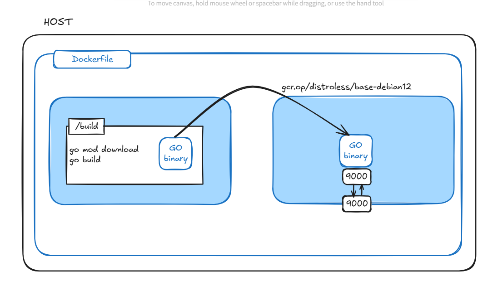
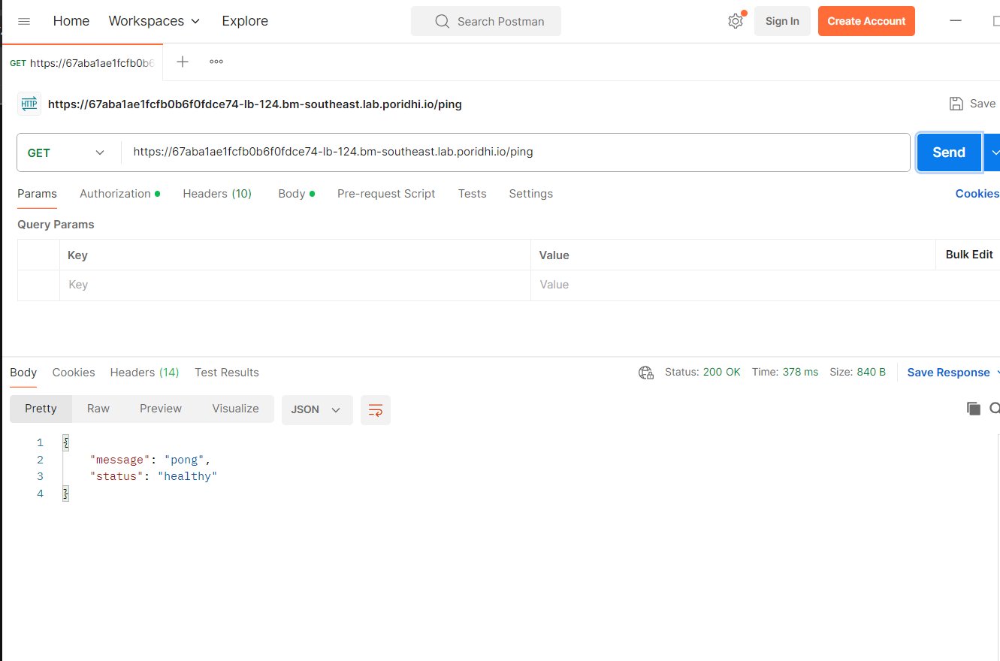
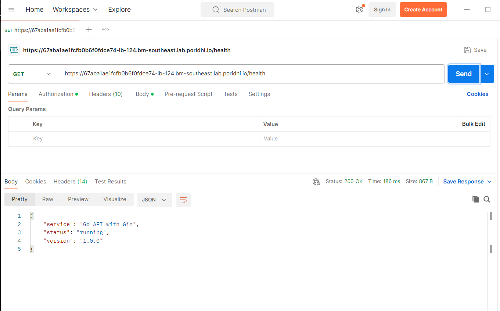
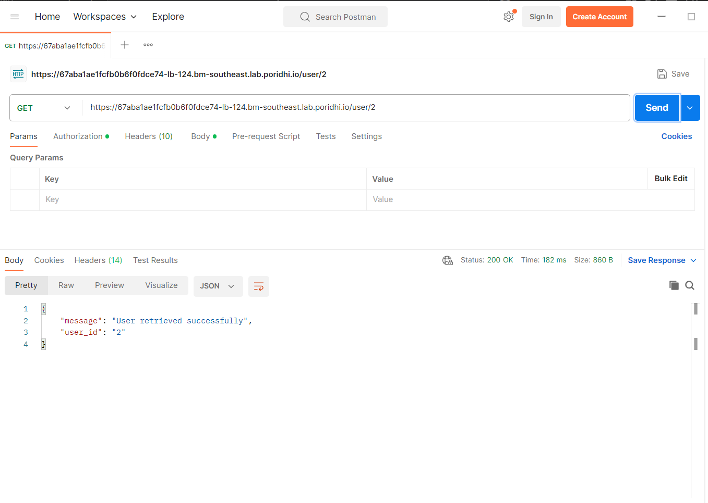
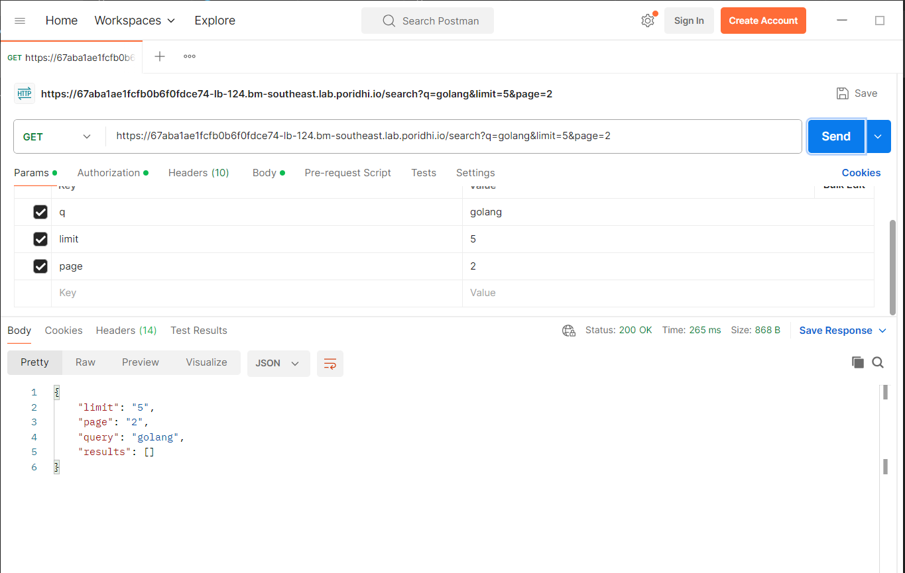

# Go API Lab - Building Your First API with Gin Framework

This lab walks you through building a RESTful API using Go and the Gin web framework. You'll learn about project structure, dependency management, environment configuration, and Docker containerization.

## Project Structure

```
lab01/
├── main.go              # Main application entry point
├── go.mod              # Go module definition and dependencies
├── .env                # Environment configuration
├── Dockerfile          # Docker container definition
├── docker-compose.yml  # Multi-container application setup
├── .gitignore          # Version control ignore rules
└── README.md           # Project documentation
```


## Structure


## Code Explanation

### 1. `go.mod` - Module Definition

```go
module go-api-lab

go 1.21

require (
	github.com/gin-gonic/gin v1.10.0
	github.com/joho/godotenv v1.5.1
)
```

**Purpose**: Defines the Go module and manages dependencies.

**Key Components**:
- **Module Name**: `go-api-lab` - identifies this module
- **Go Version**: `go 1.21` - minimum Go version required
- **Direct Dependencies**:
  - `gin-gonic/gin` - Fast HTTP web framework
  - `joho/godotenv` - Loads environment variables from `.env` files
- **Indirect Dependencies**: Auto-managed transitive dependencies

**Usage**: Run `go mod tidy` to download dependencies and update `go.sum`.

---

### 2. `.env` - Environment Configuration

```bash
# Server Configuration
PORT=9000

# Gin Framework Configuration
GIN_MODE=debug

# Application Configuration
APP_NAME=Go API Lab
APP_VERSION=1.0.0
APP_ENV=development
```

**Purpose**: Stores environment-specific configuration outside the codebase.

**Configuration Options**:
- **PORT**: Server listening port (default: 8080)
- **GIN_MODE**: Framework mode (`debug`, `release`, `test`)
- **APP_NAME/VERSION/ENV**: Application metadata

---

### 3. `main.go` - Application Entry Point

#### Package Declaration & Imports

```go
package main

import (
	"log"
	"net/http"
	"os"
	"github.com/gin-gonic/gin"
	"github.com/joho/godotenv"
)
```

**Purpose**: Declares the main package and imports required libraries.
- Standard library: `log`, `net/http`, `os`
- External: Gin framework and environment loader
In Go only import those libs that we are using in the code, same goes for declaring variables 

#### Data Structures

```go
type PingResponse struct {
	Message string `json:"message"`
	Status  string `json:"status"`
}

type HealthResponse struct {
	Service string `json:"service"`
	Status  string `json:"status"`
	Version string `json:"version"`
}
```

**Purpose**: Define structured response formats for API endpoints.

**Struct Tags**: `json:"field_name"` controls JSON serialization:
- Maps Go field names to JSON keys which enables marshaling/unmarshaling. This is for in the struct the variables goes by Message or Status but when using json format they becme message or status, 
So why not just name the variables 'message' or 'status', well this is because when we declare variables whose names start with a captital letter it automatically becomes global

#### Environment Setup

```go
func main() {
	// Load environment variables from .env file
	if err := godotenv.Load(); err != nil {
		log.Println("No .env file found, using default values")
	}

	// Get port from environment variable or use default
	port := os.Getenv("PORT")
	if port == "" {
		port = "8080"
	}
```

**Purpose**: Initialize application configuration from environment.

**Error Handling**: Proper fallback when `.env` file is missing.
**Default Values**: Ensures application works even without configuration.

#### Gin Router Configuration

```go
	// Set gin mode based on environment
	ginMode := os.Getenv("GIN_MODE")
	if ginMode == "release" {
		gin.SetMode(gin.ReleaseMode)
	}

	// Create Gin router
	router := gin.Default()
```

**Gin Modes**:
- **Debug**: Verbose logging, helpful for development
- **Release**: Minimal logging, optimized for production
- **Test**: Minimal output, used during testing

**`gin.Default()`**: Creates router with default middleware (Logger + Recovery).

#### CORS Middleware

```go
	// Add middleware for CORS (Cross-Origin Resource Sharing)
	router.Use(func(c *gin.Context) {
		c.Header("Access-Control-Allow-Origin", "*")
		c.Header("Access-Control-Allow-Methods", "GET, POST, PUT, DELETE, OPTIONS")
		c.Header("Access-Control-Allow-Headers", "Content-Type, Authorization")
		
		if c.Request.Method == "OPTIONS" {
			c.AbortWithStatus(http.StatusNoContent)
			return
		}
		
		c.Next()
	})
```

**Purpose**: Enables cross-origin requests from web browsers.

**Headers Explained**:
- **Allow-Origin**: Which domains can access the API (`*` = all)
- **Allow-Methods**: Permitted HTTP methods
- **Allow-Headers**: Allowed request headers

**OPTIONS Handling**: Browsers send preflight OPTIONS requests for CORS validation.

#### Basic Health Check Endpoint

```go
	// Basic ping endpoint - health check
	router.GET("/ping", func(c *gin.Context) {
		c.JSON(http.StatusOK, PingResponse{
			Message: "pong",
			Status:  "healthy",
		})
	})
```

**Purpose**: Simple endpoint to verify API is running.

**Components**:
- **HTTP Method**: `GET` - safe, idempotent operation
- **Route**: `/ping` - conventional health check path
- **Handler**: Anonymous function processing the request
- **Response**: JSON with 200 status code

#### Enhanced Health Check

```go
	// Enhanced health check endpoint
	router.GET("/health", func(c *gin.Context) {
		c.JSON(http.StatusOK, HealthResponse{
			Service: "Go API with Gin",
			Status:  "running",
			Version: "1.0.0",
		})
	})
```

**Purpose**: More detailed health information for monitoring systems.

**Use Cases**: Load balancer health checks, monitoring tools, service discovery.

#### Path Parameters Example

```go
	// Endpoint demonstrating path parameters
	router.GET("/user/:id", func(c *gin.Context) {
		userID := c.Param("id")
		c.JSON(http.StatusOK, gin.H{
			"user_id": userID,
			"message": "User retrieved successfully",
		})
	})
```

**Path Parameters**: `:id` creates a named parameter in the URL path.

**Extraction**: `c.Param("id")` retrieves the parameter value.
**`gin.H`**: Convenient shorthand for `map[string]interface{}`.

**Example**: `GET /user/123` → `userID = "123"`

#### Query Parameters Example

```go
	// Endpoint demonstrating query parameters
	router.GET("/search", func(c *gin.Context) {
		// Get query parameters
		query := c.Query("q")           // Required query parameter
		limit := c.DefaultQuery("limit", "10") // Optional with default
		page := c.DefaultQuery("page", "1")    // Optional with default

		// Validate required parameter
		if query == "" {
			c.JSON(http.StatusBadRequest, gin.H{
				"error": "Query parameter 'q' is required",
			})
			return
		}

		c.JSON(http.StatusOK, gin.H{
			"query":   query,
			"limit":   limit,
			"page":    page,
			"results": []string{}, // Placeholder for actual search results
		})
	})
```

**Query Parameter Methods**:
- **`c.Query("key")`**: Returns empty string if missing
- **`c.DefaultQuery("key", "default")`**: Returns default if missing

**Validation**: Check required parameters and return appropriate error.
**HTTP Status**: `400 Bad Request` for client errors.

#### Combined Parameters Example

```go
	// Endpoint combining both path and query parameters
	router.GET("/user/:id/posts", func(c *gin.Context) {
		userID := c.Param("id")
		category := c.DefaultQuery("category", "all")
		sort := c.DefaultQuery("sort", "date")

		c.JSON(http.StatusOK, gin.H{
			"user_id":  userID,
			"category": category,
			"sort":     sort,
			"posts":    []string{}, // Placeholder for actual posts
		})
	})
```

**Purpose**: Demonstrates combining path and query parameters.

**Real-world Example**: `GET /user/123/posts?category=tech&sort=date`
- Path: `userID = "123"`
- Query: `category = "tech"`, `sort = "date"`

#### Server Startup

```go
	// Start server
	log.Printf("Server starting on port %s", port)
	log.Printf("Health check available at: http://localhost:%s/ping", port)
	
	if err := router.Run(":" + port); err != nil {
		log.Fatal("Failed to start server:", err)
	}
```

**Purpose**: Start the HTTP server and handle startup errors.

**Logging**: Provides startup confirmation and useful URLs.
**Error Handling**: `log.Fatal()` exits if server can't start.

---

### 4. `Dockerfile` - Container Configuration

#### Multi-Stage Build Structure

```dockerfile
FROM golang:1.24-alpine AS builder
```

**Multi-stage Build**: Separates build and runtime environments.
**Base Image**: `golang:1.21-alpine` - minimal Linux with Go compiler.
**Stage Name**: `AS builder` - reference this stage later.

#### Build Environment Setup

```dockerfile
WORKDIR /build
COPY . .
RUN go mod download
RUN go build -o ./userapilab01
```
- WORKDIR /build → sets /build as the working directory inside the container.

- COPY . . → copies everything from your local project into /build in the container.

- RUN go mod download → downloads Go module dependencies.

- RUN go build -o ./userapilab01 → compiles your Go code into a binary named userapilab01

#### 
```dockerfile
FROM alpine:latest

WORKDIR /app
COPY --from=builder /build/userapilab01 ./main
COPY --from=builder /build/.env .

CMD ["./main"]
```
- FROM alpine:latest → starts your real final image from Alpine.

- WORKDIR /app → sets working dir.

- COPY --from=builder /build/userapilab01 ./main → copies the built Go binary into Alpine.

- COPY --from=builder /build/.env . → copies .env file.

- CMD ["./main"] → runs the binary.
### 5. `docker-compose.yml` - Multi-Container Setup

#### Service Definition

```yaml
version: '3.8'

services:
  go-api:
    build:
      context: .
      dockerfile: Dockerfile
    ports:
      - "8080:8080"
    environment:
      - PORT=8080
      - GIN_MODE=release
      - APP_ENV=production
    restart: unless-stopped
```

**Version**: Compose file format version.
**Build Context**: Use current directory and Dockerfile.
**Port Mapping**: Host port 8080 → Container port 8080.
**Environment Override**: Runtime environment variables.
**Restart Policy**: Auto-restart unless manually stopped.

#### Health Check Configuration

```yaml
    healthcheck:
      test: ["CMD", "wget", "--quiet", "--tries=1", "--spider", "http://localhost:8080/ping"]
      interval: 30s
      timeout: 10s
      retries: 3
      start_period: 40s
```

**Health Check Components**:
- **Test Command**: `wget` to ping endpoint
- **Interval**: Check every 30 seconds
- **Timeout**: Fail if no response in 10 seconds
- **Retries**: Mark unhealthy after 3 consecutive failures
- **Start Period**: Wait 40s before first check

## Quick Start Guide

### Repository & Environment Setup

```bash
# Clone the repository
git clone clone https://github.com/poridhioss/GoLabs
cd GoLabs
cd lab01
```

### Container Setup

```bash
docker-compose up -d 
```

### Access Instructions

You can access the API by creating a load balancer. First, find the IP address of your lab:

```bash
ip addr show eth0
```

Then create a load balancer using this IP address and port 8000.
The load balancer's url will be something like 
`https://67aba1ae1fcfb0b6f0fdce74-lb-307.bm-southeast.lab.poridhi.io`

---


## Testing API Endpoints

### 1. Get API Info
- **Method:** `GET`
- **Endpoint:** `/ping`




### 2. Demo Health infor
- **Method:** `GET`
- **Endpoint:** `/health`
- **Description:** Returns API version and basic information




### 3. User ID endpoint
- **Method:** `GET`
- **Endpoint:** `/user/:id`
- **Description:** Demo user id endpoint



### 4. Search query endpoint
- **Method:** `GET`
- **Endpoint:** `/search`
- **Description:** Demo search Query endpoint



